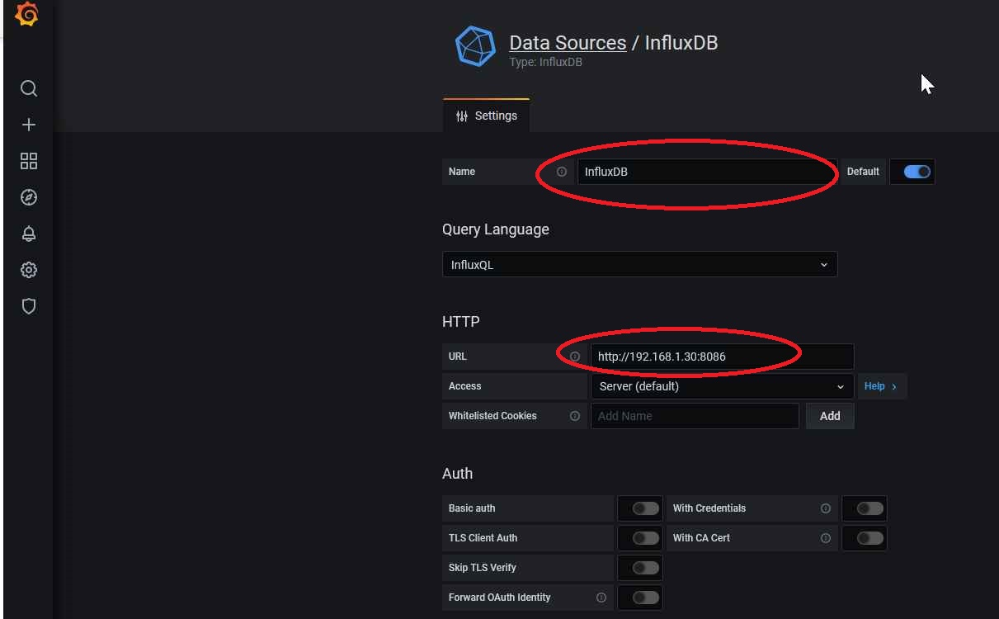

# solar-friend : introduction

Solar-friend helps you to measure and optimize your electricity consumption inside your home.  the following functions are implemented in this package.

- Electricity meter reading : read frequently (each 5 minutes) consumption/injection and calculate the actual electricity balance (Do I consume or inject electricity).
- Solar invertor data read out
- Solar forecast yield for the coming 3 days

Solar-friend does not reinvent the wheel for functions that can be full-filled by other excellent free available software :

- It is ready to integrate with home assistant (https://www.home-assistant.io/), the number one open source package for automating your home.
- Meter data (from electricity meter and inverter) are stored in an influxdb database.  How to install influxdb is described below.
- Data visualization can be done via grafana.  How to install grafana is described below together with some screenshots how to create your custom graphs.

The follow diagram is an example how solar-friend can be deployed (=my home setup in Belgium).  The raspberry pi hosts all software packages and connects to the digital electricity meter (via P1 cable), to the solar inverter and to the internet (forecast).

## 

# Installation

## Install packages

The installation is described for installation on a raspberry Pi (Raspberry Pi OS).  This does not mean that installation cannot be done on other platforms but it might require a couple of small changes.  You can find a lot of guides on youtube how you install an operating system on your raspberry Pi (for instance https://www.youtube.com/watch?v=y45hsd2AOpw).  You can also install this package on the Raspberry Pi that already contains home assistant (for instance https://www.youtube.com/watch?v=xNK3IDxSPHo).  **The IP address 192.168.1.30 used below in the text is the IP address of my Raspberry at home.  Please replace this address with the IP address of your Raspberry Pi.**  In the text below I assume that home assistant, solar-friend, influxdb and grafana are installed on one Raspberry Pi which does not have to be case.  You can perfectly split all these functions over different physical hardware platform (e.g. multiple Raspberry Pi's)

The next step is to open a terminal to your Raspberry Pi (e.g. using mobaxterm) and become root (sudo -i) 

## 


Perform the following installation steps (**adapt the timezone to your situation**) :

```bash
apt-get update
apt-get -y upgrade
apt-get install -y python3-pip
apt-get install -y git
apt-get install -y libatlas-base-dev
apt-get install -y libopenjp2-7-dev
apt install libtiff5
timedatectl set-timezone Europe/Brussels
cd
git clone https://github.com/sprenge/solar-friend.git
cd solar-friend
pip3 install -r install/requirements.txt
```
## Create your configuration file

Discover first the types that the current solar-friend version supports :

```bash
python3 main.py --capabilities
```
This list possible values for electricity meter types and inverter types (to be used to fill in the config file correctly

Now it is time to create a config file (e.g. /root/config.yml) which contains details about the devices in your home.  Copy first the example config file so you have a template to start from :

`cp /root/solar-friend/example_input.yml /root/config.yml`

Edit now the /root/config.yml file.  Customize the values to your environment and remove the sections you don't want to activate.  If you are not familiar with yaml editing, you can make use of one the online tools (e.g. https://onlineyamltools.com/edit-yaml).  Below is list which section (in bold) you need for which functionality :

- Metering value into the database : **influxdb** --> *db* and *host* are mandatory if you have an influxdb section.
- Electricity meter : **electricity_meter**--> *type* and *serial_port* are mandatory.
- solar system forecasting : **solar_system** --> please foresee *location*, *panels* and *forecast* sub sections:
  - location --> longitude and latitude of your home
- invertor : **solar_system** --> please foresee the *inverter* sub section --> *provider* and *api_key* are mandatory in case you foresee the inverter sub section.  Only one provider is supported for the moment namely solcast (https://solcast.com/).  Retrieving the api_key is free of charge in some conditions (not for commercial usage) --> see API toolkit / free registration.

## Installation of influxdb

The installation of  influxdb (in case you have raspbian buster)

```bash
wget -qO- https://repos.influxdata.com/influxdb.key | sudo apt-key add -
echo "deb https://repos.influxdata.com/debian buster stable" | sudo tee  /etc/apt/sources.list.d/influxdb.list
apt install influxdb
systemctl unmask influxdb
systemctl enable 
systemctl start influxdb
influx
> create database solar
```
tbc : install retention policy for the database


## Installation of grafana 

```bash
echo "deb https://packages.grafana.com/oss/deb stable main" | sudo tee -a /etc/apt/sources.list.d/grafana.list
apt-get install -y grafana
systemctl enable grafana-server
systemctl start grafana-server
```


## Dry run your installation

Test your installation/configuration on errors

```bash
# make sure you are still in the solar-friend directory
python3 main.py --dryrun /root/config.yml
```

Verify that database record have been created in the solar database :

```bash
influx -precision rfc3339
> use solar
> show measurements
> select * from daily_meter
> select * from inverter_total_power
```

Please note that the time is in UTC, not your local time (that is okay)

## Create service

```bash
cp install/start_solar.sh /root
chmod +x /root/start_solar.sh
cp install/meter.service /lib/systemd/system
systemctl enable meter.service
systemctl start meter.service
tail -f /var/log/syslog
```

Check in syslog that you see the following message :  Running on http://0.0.0.0:5300/, if so it means that the service is correctly started and running

## API service

The following endpoint are available (replace host by the IP address on which the solar-friend service is started):

* http://192.168.1.30:5300/solar-friend/api/v1.0/today_yield.png : get graph with the solar yield for today
* http://192.168.1.30:5300/solar-friend/api/v1.0/electricity_balance : returns the current consumption (via the key watt), a negative value indicate that more energy was pulled from the electricity net than injected, a positive value means that more energy is injected in the electricity net than consumed.
* http://192.168.1.30:5300/solar-friend/api/v1.0/day_forecast/today : returns the forecast (via the key watt) for today
* http://192.168.1.30:5300/solar-friend/api/v1.0/day_forecast/tomorrow : returns the forecast (via the key watt) for tomorrow
* http://192.168.1.30:5300/solar-friend/api/v1.0/day_forecast/day_afer : returns the forecast (via the key watt) for the day after

## Logging to influx database

*Measurements are logged into the influx database indicated in the configuration file (see influx installation)*

### daily_meter

*Raw electricity meter values are logged every morning and evening into this measurements*

### frequent_consumption_measurement

*The electricity balance (see API service) is logged every 5 minutes along with the consumption and injection values*

### inverter_daily

*Detailed inverter yield values are retrieved every evening from the inverter and stored in this mesurement (in watt).*

### inverter_total_power

*The total inverter power (in watt) since the commissioning of the inverter is logged every evening into this measurements.*

## Link to home assistant

Make sure you know the IP address of the host where the solar-friend service is running and make sure that home assistant can reach that IP address.  Please replace the IP address mentioned below (192.168.1.30) with the IP address of your own service.

Edit now the home assistant yaml file and add following config :

```yaml
sensor:
  - platform: rest
    name: last_netto_consumption
    resource: http://192.168.1.30:5300/solar-friend/api/v1.0/electricity_balance
    value_template: '{{ value_json.watt }}'
    unit_of_measurement: W
  - platform: rest
    name: solar_forecast_day_after
    resource: http://192.168.1.30:5300/solar-friend/api/v1.0/day_forecast/day_after
    value_template: '{{ value_json.watt }}'
    unit_of_measurement: W
  - platform: rest
    name: solar_forecast_tomorrow
    resource: http://192.168.1.30:5300/solar-friend/api/v1.0/day_forecast/tomorrow
    value_template: '{{ value_json.watt }}'
    unit_of_measurement: W
  - platform: rest
    name: solar_forecast_today
    resource: http://192.168.1.30:5300/solar-friend/api/v1.0/day_forecast/today
    value_template: '{{ value_json.watt }}'
    unit_of_measurement: W

camera:
  - platform: generic
    name: "yield_today"
    still_image_url: "http://192.168.1.30:5300/solar-friend/api/v1.0/today_yield.png"
```

Restart your home assistant and you will discover new sensors which you can integrate now in your lovelace panels the way you want.

## Exploring data with grafana

Open up a browser and navigate to the following url : http://192.168.1.30:3000
The first time you can loging with user **admin** and password **admin**

### Connect grafana to influxdb

Add a so called data source and press save and test to verify that grafana can connect to your database.

## 

## 

### Get an overview of your netto consumption

You can do this easily by adding a new dashboard (plus sign on the left side) and adding a new panel in the dashboard.

Once you have the panel follow these steps :
1) Select your data source created in the previous step.
2) Select your measurement.
3) Select the field from the measurement you are interested in (e.g. balance).
4) Aggregate per 5 minutes.
5) Select the time window you are interested in.

The graph represents the moments you inject electricity (you sell energy) which are the points above zero and the moments where you consume electricity (you buy energy) which are the points zero.  The unit of injection/consumption is watt.

## 

## Development guide

It is possible to add support from electricity meters and inverter that are not yet supported.  I would love to add this in advance but I only have one type of electricity meter and one type of inverter at my home so I cannot really test other types.  Fee free to add new types, please contact me (sprengee54@gmail.com) in case you have questions.

### Add electricity meters

Electricity meters can be added by mapping the meter to a profile (see electricity_meter/meter.py --> meter_types).  Extra profiles can be developed if a certain meter cannot be mapped to an existing profile (make sure the same function signature is used a for the existing profiles).  Electricity meters are currently only supported via the serial port.

### Add inverter type

New inverter types can be added by adding entries to the variable invertor_types in inverter/inverter.py
Each inverter type has to be linked to an implemented inverter class which inherits from the class InvertorBase (see inverter/base.py).